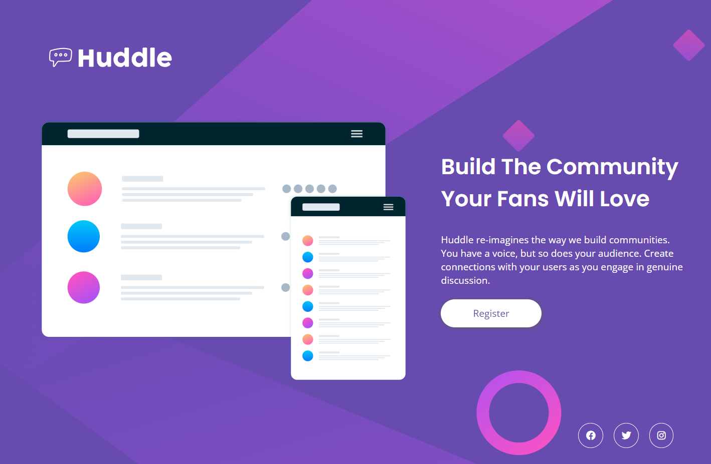

# Frontend Mentor - Huddle landing page with single introductory section solution

This is a solution to the [Huddle landing page with single introductory section challenge on Frontend Mentor](https://www.frontendmentor.io/challenges/huddle-landing-page-with-a-single-introductory-section-B_2Wvxgi0). Frontend Mentor challenges help you improve your coding skills by building realistic projects. 

## Table of contents

- [Overview](#overview)
  - [The challenge](#the-challenge)
  - [Screenshot](#screenshot)
  - [Links](#links)
- [My process](#my-process)
  - [Built with](#built-with)
  - [What I learned](#what-i-learned)
  - [Continued development](#continued-development)
  - [Useful resources](#useful-resources)
- [Author](#author)

## Overview

### The challenge

Users should be able to:

- View the optimal layout for the page depending on their device's screen size
- See hover states for all interactive elements on the page

### Screenshot
The screenshots were taken in the widths indicaded by the challange (1440x, 375px)

### Links
- Live Site URL: [https://morbitdemon.github.io/huddle-landing-page-with-single-introductory-section-master/](https://your-live-site-url.com)

## My process
- Built the HTML structure.
- Builded the Desktop Design.
- Made the changes for portrait mode.
### Built with

- Semantic HTML5 markup
- CSS custom properties
- Flexbox
- Desktop-first workflow*

### What I learned
I learned the importance of not setting a fixed width/height for a responsive design.
### Continued development

- Responsive design and layouts

### Useful resources

- [Responsive Deisgn](https://www.youtube.com/watch?v=VQraviuwbzU) - This helped me undertand the importance of not setting a fixed width/height for a responsive design..

## Author

- Frontend Mentor - [@MorbitDemon](https://www.frontendmentor.io/profile/MorbitDemon)
